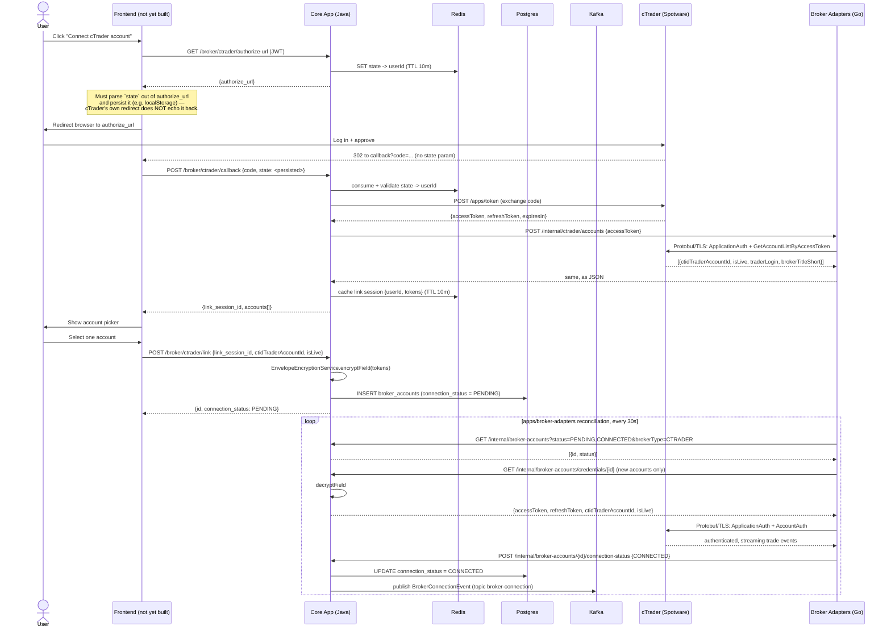

# core-app

The Core App — a Java 21 + Spring Boot modular monolith covering Auth, Onboarding/Invitations, Social/Marketplace, Billing, Admin, Analytics-read, and Notifications. Each bounded context lives in its own Gradle module under `modules/`, with a hard rule (enforced by ArchUnit in `bootstrap`) that no module may import another module's `repository` or `domain` package directly — only its `api` package, or the event bus.

## Layout

- `bootstrap/` — the Spring Boot entrypoint (`CoreAppApplication`), wiring all 7 modules together. Also owns the ArchUnit module-boundary tests and the schema/audit-log integration tests (`src/test/java/.../infra/`). Connects to Postgres as the restricted `nectrix_app` role only — never runs migrations itself.
- `modules/{auth,invitations,social,billing,admin,analytics,notifications}/` — one bounded context per module, each with `api/` (published surface), `domain/`, and `repository/` packages.
- `archunit-fixtures/` — a deliberately-violating fixture module (outside `com.nectrix.coreapp`) that `ModuleBoundaryRuleSelfTest` checks against, proving the ArchUnit rule actually fires rather than trusting an unverified assertion.
- `db/` — Liquibase migrations for the full schema (see "Database & migrations" below). Deliberately a separate Gradle subproject from `bootstrap`, so `liquibase-core` never ends up on the running app's classpath.

## Database & migrations

Full schema from `docs/06-database-schema.md` (31 tables), applied via **Liquibase** SQL-formatted changelogs in `db/src/main/resources/db/changelog/changes/` — chosen over Flyway specifically because Liquibase Community supports real per-changeset rollback for free (Flyway's `undo` is a paid Teams feature).

Two Postgres roles:
- **`nectrix`** (the existing superuser) — runs all migrations. Never used by the running app.
- **`nectrix_app`** (created by migration `001`, granted by `013`) — what `bootstrap`'s own `spring.datasource.*` connects as. Full CRUD everywhere except `audit_log`, which is INSERT+SELECT only (no UPDATE/DELETE) — `docs/17-security-architecture.md` §17.6.

```
make db-migrate       # apply all pending changesets (schema + reference data)
make db-migrate-down  # real rollback of every changeset (not clean+reapply)
make db-seed-dev      # additionally apply dev-only synthetic data (context=dev — never staging/production)
make db-status        # list pending changesets
```

Requires `POSTGRES_APP_PASSWORD` set in your `.env` (see root `.env.example`) — same no-default pattern as `POSTGRES_PASSWORD`.

## Container image

`Dockerfile` here is multi-stage (`eclipse-temurin:21-jdk-jammy` build → `eclipse-temurin:21-jre-jammy` runtime, non-root). **Build context must be the repo root**, not this directory, since the build stage needs `packages/event-contracts/java` (pulled in via `includeBuild`) as sibling source:

```
docker build -f apps/core-app/Dockerfile -t core-app .
```

CI builds, Trivy-scans (`CRITICAL,HIGH` gated), and pushes this to `ghcr.io/avison9/nectrix/core-app:<commit-sha>` on every merge to `main` — see the root README's CI/CD section. Deployed via `deploy/base/core-app/` (Kustomize), in its own `core-app` namespace.

## Auth & Identity (`modules/auth`, TICKET-005)

Login, session/refresh-token management, TOTP 2FA, and Google/Apple OAuth login. There is **no
public self-registration anywhere** — `POST /api/v1/auth/register` is not a mapped route at all (it
404s), by design (`docs/05-domain-model.md` §5.0). Every account is created internally via
`auth.api.UserProvisioningApi#createUser`, called by admin-provisioning/accept-invite tickets, never
by this module's own HTTP layer.

```
POST /api/v1/auth/login                      {email, password, totp_code?} -> {access_token, refresh_token, expires_in}
POST /api/v1/auth/oauth/{provider}/callback  {code} -> {access_token, refresh_token, expires_in}   (provider ∈ {google, apple})
POST /api/v1/auth/refresh                    {refresh_token} -> {access_token, refresh_token, expires_in}
POST /api/v1/auth/logout                     (authenticated; revokes the current session only)
POST /api/v1/auth/2fa/enable                 (authenticated) -> {secret, qr_code_uri}
POST /api/v1/auth/2fa/verify                 (authenticated) {totp_code} -> 204, flips two_factor_enabled=true
```

Access tokens are HS256 JWTs (~15 min TTL, `JWT_SIGNING_SECRET`). Refresh tokens are opaque, rotate
on every `/refresh` call, and use claim-and-rotate reuse detection: presenting an already-rotated
refresh token revokes **every** session for that user, not just the one presented (see
`AuthService#refresh`'s Javadoc for the exact race-safety mechanics). Rate limiting (Redis
INCR+EXPIRE, default 5 attempts / 15 min) applies to `/login` and `/2fa/verify`.

**OAuth status**: Google's code path is real (not a stub) and intended to get a live end-to-end test
once a real client exists, but that manual round-trip hasn't been run yet — set
`GOOGLE_OAUTH_CLIENT_ID` / `GOOGLE_OAUTH_CLIENT_SECRET` in `.env` from a Google Cloud OAuth 2.0
web-app client (redirect URI `http://localhost:8080/api/v1/auth/oauth/google/callback`) to exercise
it. Apple's code path is implemented (same
generic `OidcIdTokenVerifier` machinery) but **not tested against Apple's real servers** — see
`AppleOAuthProvider`'s Javadoc for two known gaps that need resolving before it's activated for
real: Apple's `client_secret` must be a periodically-regenerated ES256 JWT (not a static string),
and Apple only includes the user's email on their *first* authorization, never on repeat logins.

2FA secrets are encrypted via TICKET-011's real KMS-backed envelope encryption (`modules/crypto`'s
`EnvelopeEncryptionService`) — the temporary local AES-GCM stub
(`TWO_FACTOR_SECRET_ENCRYPTION_KEY`/`StubAesGcmTwoFactorSecretCipher`) is deleted outright, not left
as a fallback. See "Secrets Management & Envelope Encryption" below.

## RBAC (TICKET-006)

Roles are additive, not exclusive (`user_roles` join table): `FOLLOWER`, `MASTER`, `PARTNER`,
`ADMIN`, `SUPPORT`. Two independent enforcement layers, per `docs/17-security-architecture.md`
§17.3:

- **Coarse, route-level** — plain `@PreAuthorize("hasRole(...)")`/`hasAnyRole(...)` on controller
  methods, using the `ROLE_*` authorities `auth.config.SecurityConfig`'s `JwtAuthenticationConverter`
  already derives from the access token's `roles` claim. No custom annotation.
- **Fine, object-level (IDOR prevention)** — `@PostAuthorize` on a service method, referencing
  `auth.security.SecurityPermissions` (bean name `perms`) by SpEL:
  `@PostAuthorize("@perms.isOwnerOrStaff(authentication, returnObject.userId())")`. This is a
  *runtime* bean-name lookup, not a compile-time import, so it works across module boundaries
  without violating `ModuleBoundaryArchTest`. See `invitations.service.BrokerAccountService` for the
  reference implementation — reuse this exact pattern for any future per-user-owned resource
  (`CopyRelationship`, `Invitation`, `BrokerIBLink`, `BrokerFeeReport`, ...). Reads only — a future
  write endpoint needs an explicit imperative guard instead (see that class's Javadoc for why).

Demo endpoints (real role/ownership enforcement, but not real features — `BrokerAccount` linking and
`performance_fee_ledger` logic are Phase 1):

```
GET  /api/v1/broker-accounts/{id}          (authenticated; owner or ADMIN/SUPPORT only — 403/404 otherwise)
POST /api/v1/admin/impersonate/{userId}    (ADMIN/SUPPORT) -> {access_token, expires_in}, JWT tagged impersonated_by=<acting admin/support id>
POST /api/v1/admin/ledger-adjustments      (ADMIN only — SUPPORT gets 403) {target_type, target_id, amount, reason} -> 204
GET  /api/v1/admin/broker-accounts/{id}    (ADMIN/SUPPORT — bypasses ownership) -> same shape as the Follower-facing route
```

Every admin/support action above writes one `audit_log` row (`docs/17-security-architecture.md`
§17.6 — write-only at the app-DB-role level).

Role management for existing accounts is still a CLI (TICKET-012's Admin Portal adds a UI for
provisioning brand-new Admin/Support accounts with a role assigned at creation, not for changing an
existing account's roles):

```
make role-grant EMAIL=foo@example.com ROLE=ADMIN
make role-revoke EMAIL=foo@example.com ROLE=ADMIN
make role-list EMAIL=foo@example.com
```

## Observability (TICKET-010)

The OpenTelemetry Java auto-instrumentation agent (`apps/core-app/Dockerfile` fetches a pinned release jar at build time, attached via `-javaagent`) auto-instruments Spring MVC/JDBC — zero code changes for tracing. `spring-boot-starter-actuator` + `micrometer-registry-prometheus` expose `/actuator/prometheus` (real `http.server.requests` histogram, no custom metric code needed). `logback-spring.xml` switches console logging to structured JSON (`net.logstash.logback:logstash-logback-encoder`) with a `MaskingJsonGeneratorDecorator` masking allow-listed sensitive field names (`password`, `secret`, `token`, `credential`, `credentials`, `ciphertext`, `apiToken`, `client_secret`) — see `HelloController`'s deliberately-logged fake `secret` field for a live example. `trace_id`/`span_id` land in every log line automatically via the agent's Logback MDC instrumentation, no extra wiring.

`OTEL_EXPORTER_OTLP_ENDPOINT`/`OTEL_SERVICE_NAME` (defaults: `http://localhost:4318`/`core-app`) are read by the agent directly — docker-compose.yml points this at the local Tempo instance. See root `README.md`'s Observability section and `infra/observability/verify.sh` for hands-on AC verification.

## Secrets Management & Envelope Encryption (`modules/crypto`, TICKET-011)

`EnvelopeEncryptionService` is real KMS-backed envelope encryption, replacing TICKET-005's temporary
local AES-GCM 2FA-secret stub outright (`StubAesGcmTwoFactorSecretCipher` is deleted, not left as a
fallback). Per field: a fresh Data Encryption Key (DEK) is generated via KMS `GenerateDataKey`, used
to AES-256-GCM-encrypt the plaintext locally, and the KMS-wrapped DEK is packed alongside the field
ciphertext into one opaque stored string. `kms_key_versions` is the explicit, application-level
version registry (distinct from a cloud KMS's own opaque internal rotation) — a KEK rotation never
needs a synchronous full-table re-encryption; old ciphertext stays decryptable via the KMS key ID its
tagged version points to.

`AwsEnvelopeKmsClient` (AWS SDK v2) is endpoint-overridable so the identical code path talks to
**LocalStack** locally/in CI and real AWS KMS in production (IRSA credential chain). `make
localstack-init` (`infra/localstack/init-kms.sh`) seeds the real LocalStack key + `kms_key_versions`
row. Verified hands-on against real LocalStack KMS + Postgres: a real encrypt→decrypt round trip; a
real KEK rotation (old ciphertext still decrypts, a fresh encryption gets the new version); and a
redaction proof (`/2fa/enable`'s real plaintext TOTP secret confirmed absent from captured stdout,
only the masked `"secret":"****"` form present).

## Admin endpoints (TICKET-012)

Two more ADMIN/SUPPORT-gated routes, backing `apps/admin-portal`'s real (non-stub) pages — see that
app's own README for the frontend side:

```
POST /api/v1/admin/users        (ADMIN only) {email, password, display_name, role: ADMIN|SUPPORT} -> 201 {id}
GET  /api/v1/admin/audit-log    (ADMIN/SUPPORT) ?actorUserId=&targetType=&targetId=&from=&to=&page=&pageSize= -> paginated real audit_log rows
```

`POST /api/v1/admin/users` is the platform's account-creation entry point — there is still no
self-registration anywhere. It rejects any `role` outside `{ADMIN, SUPPORT}` with 400 —
`POST /api/v1/admin/masters` (which also creates a `master_profiles` row) is a separate, deferred
Phase 1 endpoint. Both routes write one audited `audit_log` row (provisioning) or are themselves
read-only (the Audit Log viewer's data source), same write-restriction guarantee as every other
`audit_log` writer above.

## cTrader Broker Linking (`modules/invitations`, TICKET-101)

Real (not stubbed) cTrader Open API OAuth linking — the first Phase 1 feature to talk to a live
external broker. Core App owns the OAuth handshake, `broker_accounts` row lifecycle, and is the
**single** `EnvelopeEncryptionService` caller for broker credentials; `apps/broker-adapters` (Go)
owns 100% of the cTrader wire protocol (Protobuf/TLS) and never sees plaintext tokens except
per-request, over an internal-only HTTP hop. See that app's own README for the Go side.

```
GET  /api/v1/broker/ctrader/authorize-url   (authenticated) -> {authorize_url}
POST /api/v1/broker/ctrader/callback        (permitAll — see note below) {code, state} -> {link_session_id, accounts[]}
POST /api/v1/broker/ctrader/link            (authenticated) {link_session_id, ctid_trader_account_id, is_live, display_label} -> BrokerAccount
```

Internal-only, called by `apps/broker-adapters`, guarded by a second `SecurityFilterChain`
(`SecurityConfig#internalFilterChain`) checking a shared `X-Internal-Service-Token` header instead
of a JWT — the *only* non-JWT auth path in this codebase:

```
GET  /internal/broker-accounts?status=&brokerType=              -> [{id, status}]
GET  /internal/broker-accounts/credentials/{id}                 -> {accessToken, refreshToken, ctidTraderAccountId, isLive}
POST /internal/broker-accounts/{id}/connection-status {status, detail} -> 200, publishes BrokerConnectionEvent
```

### Architecture — full linking + reconciliation flow



### Real, live-verified findings

Verified hands-on against a real cTrader demo account (Pepperstone-hosted, via a real registered
cTrader Open API application) — not mocked, not just "it compiles": the full authorize → code
exchange → account listing → link → reconcile → `CONNECTED` chain above, exactly as drawn, using
real HTTP calls to `connect.spotware.com`/`openapi.ctrader.com` and a real Protobuf/TLS connection
from `apps/broker-adapters` to `demo.ctraderapi.com:5035`. Two real things this pass caught (both
now fixed and covered by regression tests, not just noted and left):

- **cTrader does not echo the OAuth `state` query param back on redirect** (only `code` comes
  back), unlike a spec-compliant OAuth2 provider. This is not a backend bug — `state`-based CSRF
  protection is still real and correct — but it moves a real responsibility onto whoever builds the
  frontend piece: capture `state` from the `authorize_url` response *before* redirecting, persist
  it (survives the full top-level navigation), and re-attach it after the redirect. See
  `BrokerAccountOAuthController`'s Javadoc for the exact detail. A cookie-based fallback was
  considered and rejected — this codebase is deliberately cookie-free (see `SecurityConfig`'s own
  Javadoc), and introducing one here would be a first, inconsistent exception.
- `apps/broker-adapters`' reconciliation loop connected successfully but never reported that back
  to Core App — `connection_status` stayed `PENDING` forever despite a genuinely healthy connection.
  Fixed by adding the missing `POST .../connection-status` caller
  (`internal/coreappclient.Client.ReportConnectionStatus`) and wiring it into
  `internal/reconcile.Loop`'s connect/disconnect paths — see that package's own tests.

**Known gap, not yet built**: the frontend page that catches cTrader's browser redirect and makes
the actual `POST /callback` call. The callback endpoint is deliberately POST-only (matching the
existing Google/Apple OAuth pattern), so a real end-to-end flow needs that piece before a user can
complete linking without a developer manually replaying the `code`/`state` via curl, as this
verification pass did.

**Also deferred** (flagged in code, not silently assumed): `AccountSnapshot.currency` and
`SymbolSpec.marginCurrency` (`apps/broker-adapters`) are left empty pending a cTrader
assetId→currency-code lookup not built in this ticket; `broker_accounts.currency` is seeded as a
`"USD"` placeholder at link time for the same reason, corrected once a real account snapshot is
read.

### Manual reproduction (runbook)

Until the frontend piece exists, this is how to replay the full flow by hand — exactly what this
ticket's own live verification pass did. Needs a real cTrader Open API application (register one at
[connect.spotware.com](https://connect.spotware.com), add
`http://localhost:8080/api/v1/broker/ctrader/callback` to its allowed redirect URIs) and a real
cTrader demo account logged into in your browser.

1. **Set real credentials** in `.env` (see root `.env.example`): `CTRADER_CLIENT_ID`,
   `CTRADER_CLIENT_SECRET`, `INTERNAL_SERVICE_TOKEN` (any value, must match on both services).
2. **Run both services** with those env vars: `./gradlew :bootstrap:bootRun` (core-app, port 8080)
   and `go run .` in `apps/broker-adapters` (port 8091) — both need Postgres/Redis/Kafka up
   (`docker compose up`).
3. **Get a JWT** for any real user (login via `POST /api/v1/auth/login`, or provision one first via
   `UserProvisioningApi`/an admin route — there's no public self-registration).
4. **Get the authorize URL**:
   ```
   curl -s http://localhost:8080/api/v1/broker/ctrader/authorize-url \
     -H "Authorization: Bearer $ACCESS_TOKEN"
   # => {"authorize_url": "https://connect.spotware.com/apps/auth?...&state=<STATE>"}
   ```
5. **Open `authorize_url` in a real browser**, log into the cTrader demo account, approve. The
   browser lands on `http://localhost:8080/api/v1/broker/ctrader/callback?code=<CODE>` and shows a
   405 error page — expected, that endpoint is POST-only (see the note above on why). Copy `<CODE>`
   from the address bar. Remember `<STATE>` from step 4 — the redirect does **not** include it.
6. **Complete the code exchange** (must be within the state's 10-minute Redis TTL):
   ```
   curl -s -X POST http://localhost:8080/api/v1/broker/ctrader/callback \
     -H 'Content-Type: application/json' \
     -d "{\"code\":\"<CODE>\",\"state\":\"<STATE>\"}"
   # => {"link_session_id": "...", "accounts": [{"ctid_trader_account_id": ..., "is_live": false, ...}]}
   ```
7. **Link the chosen account**:
   ```
   curl -s -X POST http://localhost:8080/api/v1/broker/ctrader/link \
     -H 'Content-Type: application/json' -H "Authorization: Bearer $ACCESS_TOKEN" \
     -d '{"link_session_id":"<LINK_SESSION_ID>","ctid_trader_account_id":<ID>,"is_live":false,"display_label":"My demo account"}'
   # => {"id": "...", "connection_status": "PENDING", ...}
   ```
8. **Wait up to 30s** and confirm `apps/broker-adapters` picked it up and connected:
   ```sql
   SELECT connection_status, last_health_check_at FROM broker_accounts WHERE id = '<returned id>';
   -- expect connection_status = 'CONNECTED', last_health_check_at set
   ```
   `apps/broker-adapters`' own logs show `reconcile: connected broker account brokerAccountId=<id>`.

## Commands

Run from the repo root (see root `README.md` for the devcontainer setup):

```
make core-app-build   # ./gradlew build
make core-app-test    # ./gradlew test — includes the ArchUnit boundary checks
```

`bootstrap` exposes `GET /hello` on port 8080 once running (`./gradlew :bootstrap:bootRun`). Auth
integration tests (`./gradlew :bootstrap:integrationTest`) need Postgres + Redis + LocalStack running
(see root `docker-compose.yml`, `make localstack-init`) and `JWT_SIGNING_SECRET` set — same
no-default pattern as `POSTGRES_APP_PASSWORD` (see `.env.example`).
