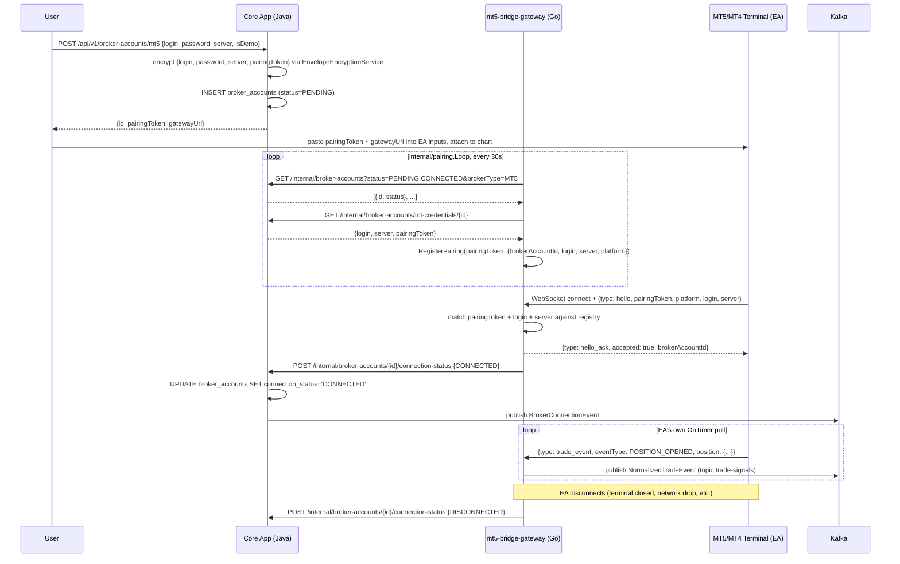

# mt5-bridge-gateway

The Go gateway process MT5/MT4 Expert Advisors dial **into** — the inverse direction of
`apps/broker-adapters`' cTrader adapter, which dials **out** to Spotware's servers. MetaTrader has no
first-party API a third-party SaaS can connect to arbitrary end-user accounts with
(`nectrix_plan/docs/07-auth-onboarding-broker-linking.md` §7.7), so a real EA running inside the
user's own MT5/MT4 terminal connects out to this gateway and speaks a JSON message protocol this
service defines and terminates — over a persistent WebSocket for MT5, or HTTP long-polling for MT4
(TICKET-121: MQL4 has no native `Socket*()` functions, so it can't speak WebSocket at all — see
"EA source" below).

TICKET-001 stood up the module skeleton and a `/healthz` hello-world endpoint. **TICKET-102 replaced
that skeleton with the real EA-bridge**, serving **both MT5 and MT4** from one process — pulling MT4
forward from its original Phase-3 scope (`TICKET-311`) alongside MT5, at the user's request. Both
platforms share ~90% of the Go-side code (see below); the EA source itself (MQL5/MQL4, `ea/`) is the
only genuinely per-platform piece, since that's what talks to each terminal's own native trading API.

## Architecture



## Why a pairing token, not OAuth

Unlike cTrader (`apps/broker-adapters`), MT5/MT4 linking is **direct-credential**, not OAuth
(`docs/14-api-specification.md` §14.3: `POST /api/v1/broker-accounts/mt5 {login, password, server,
is_demo}`). Core App generates a random opaque `pairingToken` at link time, encrypts it alongside the
credentials, and returns it to the user to paste into their EA's own input parameters when attaching
it to a chart — the same "connect code" pattern several real commercial MT4/5 bridge products use.
This gateway never dials anywhere; it's a passive WebSocket server that only accepts a session once it
recognizes the token a connecting EA presents.

## Packages (`internal/`)

- **`eabridge`** — the wire protocol server: WebSocket upgrade (MT5) or HTTP hello/poll/events
  routes (MT4, TICKET-121 — see `httphandler.go`), hello handshake (pairing-token + login/server
  cross-check — defense against a leaked token being used for the wrong account), per-session
  request/response correlation (`Session.RequestSnapshot`/`RequestPositions`/`RequestSymbolSpec`/
  `SendOrderCommand`), and trade-event fan-out to multiple subscribers (the Kafka-publish callback
  wired automatically at session creation, plus any `StreamTradeEvents` caller). Both transports
  feed the exact same `Session`/`readLoop`/`call` logic via the `wsConn` interface
  (`httpconn.go`'s `httpPollConn` satisfies the same 3-method interface a real `*websocket.Conn`
  does), so everything past the handshake is transport-agnostic. See `wire.go` for the full message
  catalog — this is the file both `ea/mt5/*.mq5` and `ea/mt4/*.mq4` are written against,
  message-for-message, regardless of transport.
- **`mtadapter`** — the `domain.BrokerAdapter` implementation, `NewMT5`/`NewMT4` constructing the
  *same* underlying type over a shared `eabridge.Server`, differing only in a `brokerType` field.
  `Connect` never dials — it just checks whether a live paired session already exists for the
  account (a "not yet paired" failure is expected/routine for a `PENDING` account, not exceptional).
  Adapter-wide symbol cache (`ResolveSymbol`/`GetSymbolSpecification`) mirrors `internal/ctrader`'s
  own compromise for the identical interface-shape reason.
- **`pairing`** — the discovery loop keeping `eabridge.Server`'s pairing-token registry in sync with
  Core App's listing of PENDING/CONNECTED MT5/MT4 accounts (polls the *same, unmodified* internal
  listing endpoint TICKET-101 built, plus the new `mt-credentials` endpoint). `StatusHandler`
  implements `eabridge.SessionEventHandler`, reporting CONNECTED/DISCONNECTED to Core App the moment
  a real EA session is established/lost — reusing the exact `StatusReporter` contract/endpoint
  TICKET-101 built (and fixed a real missing-caller bug in).
- **`dedupadapter`**, **`tradesignals`**, **`coreappclient`** — the MT5/MT4-side counterparts of
  `apps/broker-adapters`' identically-named packages (duplicated, not imported: Go's own
  internal-package visibility rule scopes an `internal/` package to importers rooted at its own
  module, and these are two separate Go modules/binaries in this monorepo — see each package's own
  doc comment).

Go never touches Postgres directly, and never sees the terminal password: Core App decrypts and
returns only `{login, server, pairingToken}` from the new `mt-credentials` endpoint — see
`apps/core-app/README.md`'s MT5/MT4 section for the Java side.

## EA source (`ea/`)

- **`ea/mt5/NectrixBridgeMT5.mq5`** — the MT5 Expert Advisor.
- **`ea/mt4/NectrixBridgeMT4.mq4`** — the MT4 Expert Advisor.

The two EAs speak different transports (TICKET-121). `NectrixBridgeMT5.mq5` implements RFC 6455
WebSocket framing **by hand** over MQL5's raw `Socket*` functions (neither MQL5 nor MQL4 has a
built-in WebSocket client) — the HTTP Upgrade handshake, then masked client→server / unmasked
server→client frame encode/decode. `NectrixBridgeMT4.mq4` instead speaks HTTP long-polling via
MQL4's native `WebRequest()` — a real, live-verified finding (9 real MetaEditor compile errors)
that MQL4 has no native `Socket*()` functions at all, so it can never speak WebSocket the way MT5
does; `ConnectGateway`/`PollGateway`/`PostEvent` POST to the gateway's `/ea/hello`/`/ea/poll`/
`/ea/events` routes instead. Both EAs use the same targeted (not general-purpose) JSON extraction
against the fixed message shapes in `internal/eabridge/wire.go` — MT4 additionally has
`JsonExtractArray`, a depth-and-string-aware bracket scan needed to split `/ea/poll`'s
`"messages":[...]` array into individually-dispatchable objects (unnecessary for MT5, which reads
one message per WebSocket frame instead). Both detect trade lifecycle events by diffing consecutive
position snapshots on a timer (MT5's/MT4's own trading APIs have no push-event model), and execute
`order_command`s via `CTrade` (MT5) / `OrderSend`/`OrderModify`/`OrderClose` (MT4, no netting —
one ticket per position).

**Honest limitation**: this code is written against the real, tested protocol (`internal/eabridge`'s
own test suite — including `httptransport_test.go`'s HTTP-transport coverage for TICKET-121 — proves
the Go side genuinely speaks it correctly on both transports), but neither EA has ever been compiled
by this session — MetaEditor requires a real MT5/MT4 terminal (Windows, or Wine on Linux), unavailable
in this devcontainer. The MT4 rewrite in particular has only been reviewed by hand against MQL4's
documented APIs, the same way the original (broken) MT4 source was written before its own real
compile failure — see `apps/mt-terminal-host/README.md` findings 3 and 9 for what's still unverified
(a real compile of the rewritten `.mq4`, and whether `entrypoint.sh`'s headless WebRequest allow-list
attempt is actually honored by a real terminal). See "Live verification" below for what's been proven
automatically vs. what needs a real terminal.

## Design references

- `nectrix_plan/docs/07-auth-onboarding-broker-linking.md` §7.7 — MT5/MT4 linking strategy decision framework.
- `nectrix_plan/docs/13-technology-stack.md` §13.1 — why Go for the gateway, MQL5 for the EA.
- `nectrix_plan/docs/14-api-specification.md` §14.3 — the direct-credential linking endpoint shape.
- `nectrix_plan/phases/phase-1-mvp/tickets/TICKET-102-mt5-adapter.md` — the real MT5 adapter/bridge implementation.
- `nectrix_plan/phases/phase-3-enterprise/tickets/TICKET-311-additional-broker-adapter.md` — MT4's original (superseded) Phase-3 scope.
- `apps/broker-adapters/README.md` — the cTrader adapter this service's `dedupadapter`/`tradesignals`/`coreappclient` packages mirror.

## Dependencies

- `packages/go-domain` — shared normalized domain types, `BrokerTypeMT5`/`BrokerTypeMT4`, the `Deduper` idempotency interface.
- `packages/redis-client/go` — the shared idempotency (`dedupadapter`) primitive.
- `packages/event-contracts/go` — the `trade-signals` Kafka message contract.
- `github.com/gorilla/websocket` — RFC 6455 server implementation (the Go side only; the EA side hand-rolls the client half, see above).

All tied together via the root `go.work`.

## Configuration

Real env vars this service reads (see root `.env.example`):

| Var | Required | Notes |
|---|---|---|
| `INTERNAL_SERVICE_TOKEN` | yes | Shared secret authenticating to Core App's internal endpoints — must be byte-for-byte identical to Core App's own copy. |
| `CORE_APP_INTERNAL_BASE_URL` | no (default `http://localhost:8080`) | Where `coreappclient` calls Core App's internal API. |
| `REDIS_HOST`/`REDIS_PORT`, `KAFKA_HOST`/`KAFKA_PORT` | no (localhost defaults) | Standard connection config, same convention as `apps/broker-adapters`. |

The EA's own inputs (`PairingToken`, `GatewayHost`, `GatewayPort`, `GatewayPath`) are set per-chart in
the terminal, not env vars — see the linking response (`gatewayUrl` = `ws://<host>:8092/ea/ws` by
default, `nectrix.invitations.mt-bridge.gateway-url` on the Core App side, `MT_BRIDGE_GATEWAY_URL`).

## Container image

`Dockerfile` here is multi-stage (`golang:1.26.4-bookworm` build → `gcr.io/distroless/static-debian12:nonroot` runtime). **Build context must be the repo root**, not this directory:

```
docker build -f apps/mt5-bridge-gateway/Dockerfile -t mt5-bridge-gateway .
```

CI builds, Trivy-scans, and pushes this to `ghcr.io/avison9/nectrix/mt5-bridge-gateway:<commit-sha>` on every merge to `main` — see the root README's CI/CD section. Deployed via `deploy/base/mt5-bridge-gateway/` (Kustomize), in the `copy-engine` namespace.

## Commands

```
make go-build   # builds all Go modules, including this one
make go-test    # tests all Go modules, including this one (unit only — see below for integration)
make go-lint    # golangci-lint across all Go modules
```

Real integration tests (need live infra — Redis via `docker compose up`):
`go test -tags=integration ./internal/dedupadapter/...`

Run directly: `go run .` (listens on `:8092`; MT5's EA WebSocket endpoint at `/ea/ws`, MT4's HTTP
long-polling endpoints at `/ea/hello`/`/ea/poll`/`/ea/events`) — needs the env vars above set.

## Live verification

**What's proven automatically, no real terminal needed** (`internal/eabridge`, `internal/mtadapter`,
`internal/pairing` test suites — `make go-test`): the entire Go gateway side, against **real**
connections from fake-EA test clients this repo controls — for MT5, a real `gorilla/websocket`
client dialer (`net/http/httptest` + a real socket, not a mock); for MT4 (TICKET-121,
`httptransport_test.go`), a real `net/http` client speaking the exact `/ea/hello`/`/ea/poll`/
`/ea/events` sequence a real `WebRequest()`-based EA would. Both cover: handshake accept/reject
(unknown token, login/server mismatch, platform mismatch), session supersession, request/response
round trips (snapshot, positions, symbol spec, order commands — including the rejected-order path),
trade-event fan-out to multiple subscribers, session-lost cleanup, and concurrent-request correlation
under `-race`. Also manually smoke-tested as a real compiled binary (`go build` + run): `/healthz`
responds, a real external WebSocket client process (not the Go test harness) gets a real handshake
rejection for an unknown token, and SIGTERM triggers the real drain→shutdown sequence.

**What needs a real terminal** (this repo's own limitation, not a design gap — see `ea/`'s "Honest
limitation" above): compiling and running `ea/mt5/NectrixBridgeMT5.mq5` / `ea/mt4/NectrixBridgeMT4.mq4`
against a live MT5/MT4 demo account. Runbook:

1. **Link the account** (Core App must be running): `POST /api/v1/broker-accounts/mt5` (or `/mt4`)
   with a real demo account's `{login, password, server, is_demo: true}`. Save `pairingToken` and
   `gatewayUrl` from the response.
2. **Open MetaEditor** (bundled with the MT5/MT4 terminal — Windows, or Wine on Linux), open
   `ea/mt5/NectrixBridgeMT5.mq5` (or the MT4 file in an MT4 terminal), compile (F7). A clean compile
   with zero errors is itself part of this verification — this file has never been run through a real
   compiler before this runbook.
3. **Attach the EA** to any chart. In the EA's Inputs tab, set `InpPairingToken` to the saved token,
   `InpGatewayHost`/`InpGatewayPort` from `gatewayUrl` (default `127.0.0.1`/`8092` if the gateway runs
   locally alongside the terminal, or the real reachable host if not).
4. **Confirm pairing**: the EA's `Experts` log should show `Nectrix: paired, brokerAccountId=...`;
   `gateway`'s own log should show `eabridge: EA session established`; and a `GET
   /api/v1/broker-accounts/{id}` (or a direct `psql` check) should show `connection_status =
   'CONNECTED'` within one `pairing.Loop` poll cycle (≤30s) of the reported status flowing through.
5. **Confirm a real trade event**: open a position manually in the terminal (or place one via a
   `PLACE` `order_command` sent by hand against the gateway for testing). Confirm a `trade_event`
   frame reaches the gateway's log and a `NormalizedTradeEvent` lands on the `trade-signals` Kafka
   topic (`docker exec` into the Kafka container, `kafka-console-consumer`, or Kafka UI at the
   forwarded port).
6. **Confirm graceful disconnect**: detach the EA (or close the terminal). Confirm
   `connection_status` flips to `DISCONNECTED` and the gateway's session registry no longer lists the
   account (`eabridge: EA session lost` in the log).

This mirrors TICKET-101's own live-verification discipline (`apps/core-app/README.md`'s cTrader
runbook) — the parts this environment can prove itself are proven with real network connections and
`-race`-clean concurrency tests, not mocks; the parts that genuinely require hardware/software this
devcontainer doesn't have are documented as an explicit runbook for whoever has that terminal, not
silently skipped.
